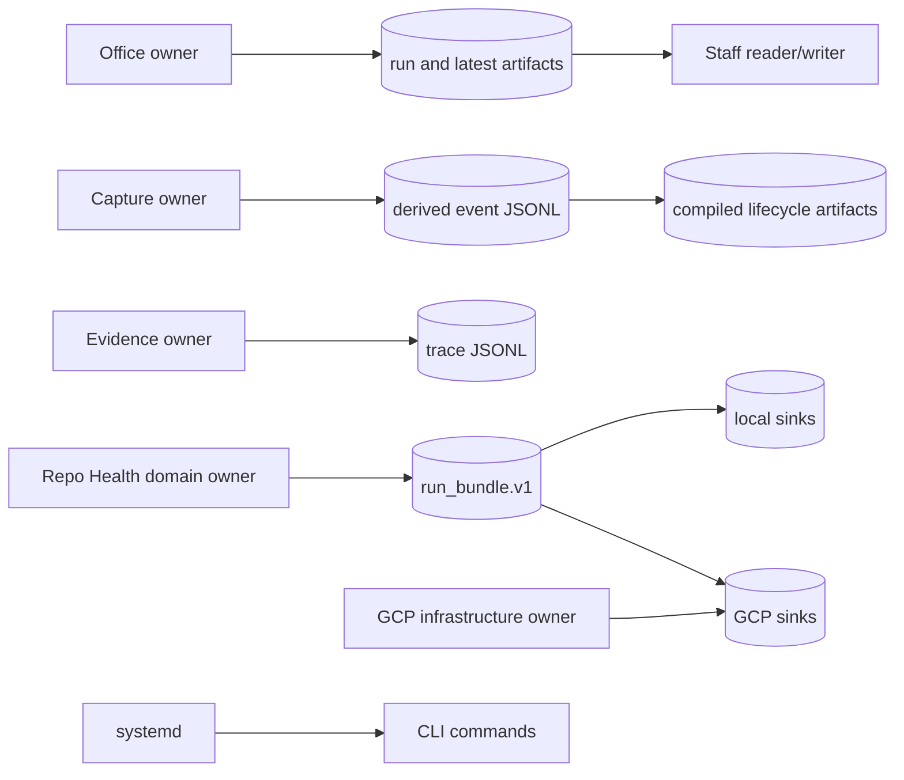

# Ownership and state

**Status:** canonical
**Audience:** contributors, maintainers, operators diagnosing drift, and agents
**Owner:** office-auto-lab maintainers
**Verified against:** `cda8b286cc5db3c840d7f4dad143d62497f18a63`

## Scope

This page identifies the authoritative writer, readers, update mode, and
contract for shared state. “Owner” means the module that defines meaning and
write behavior—not necessarily the infrastructure that stores bytes.

## Ownership model

The diagram separates semantic ownership from storage. Repo Health defines the
run bundle; local files, GCS, and BigQuery persist that same meaning. Automation
starts commands but does not become the owner of their state.

## State-writer matrix

| State / artifact | Authoritative writer | Readers | Update and completion rule | Contract / evidence |
|---|---|---|---|---|
| Front, carry, runtime, support sheet inputs | External spreadsheet owners | Office and staff; local Repo Health runner reads its own policy tabs | Outside this repository; Office access is read-only | Sheet column validation and configured gids |
| `artifacts/runs/<run-id>/` Office tree | `office.compile.run_compile` | Operators; promotion step | New run directory; error or success manifest summarizes run | Manifest fields plus fixture shapes |
| `artifacts/latest/` Office snapshot | `office.io.promote_latest` | Staff, UI/other local consumers, operators | Clear and copy only after successful Office compile | Successful run manifest; not an immutable store |
| Staff scan files | `staff.bundles` via source scripts | Bundle and brief builders | Reused or overwritten by scan mode/project id | Script output; no versioned schema |
| Staff bundles and `ai_jobs.csv` | `staff.bundles.build_bundles` | Staff brief builder and humans | Rewritten in `latest`; bundle filename is type/project | Bundle JSON shape in source and fixture |
| Staff briefs and `brief_index.csv` | `staff.briefs.build_staff_briefs` | Humans/UI | Rewritten in `latest` | Deterministic renderer and fixture |
| Raw capture JSONL/audio | External capture producer | Transcription and lifecycle compiler | Append/file creation outside this repository's compiler | Event expectations in capture code/tests |
| Derived capture-processing JSONL | Capture transcription/processing functions | Later stages and lifecycle compiler | Append-only; duplicate stage suppressed unless forced; dry-run does not append | Event validation and capture tests |
| Lifecycle/candidate artifacts | `capture.lifecycle` | Humans/UI/review workflow | Recompiled observer snapshot in selected output directory | Capture schemas where applicable and lifecycle tests |
| Git/files trace JSONL | Evidence tracers | Caller-defined | Output file written at caller-required path | Row construction in trace modules |
| Run/event/daily logs | `RunLogger` and `append_ledger` | Operators | Append-only local text/JSONL | Logging module formats; not domain completion markers |
| Sheet-backed Repo Health effective run set | `repo_health.runner` | Operator and runner | Sheet tab overwrite unless `--no-write` | Policy semantics/tests |
| Sheet-backed plugin results | `repo_health.runner` | Frontier exporter, humans | Append rows unless `--no-write`; summary columns may update with `--apply` | Runner/sheets semantics tests |
| `out/frontier/latest.csv` and dated frontier | `frontier_export` | Prepared-block compiler | Latest and dated files rewritten per run | Deterministic column/sort logic |
| `run_bundle.json` | Repo Health run-bundle model | Local/GCP evidence and history sinks, compiler consumers | Canonical JSON; immutable per run id | `spec/run_bundle.schema.json` |
| Local Repo Health packet | `LocalRunEvidenceSink` | Operators/tools | Atomic publish; exact replay no-op; conflicting run id rejected | Packet manifest and sink tests |
| Local Repo Health history | `JsonlHistorySink` | Operators/tools | Append once per run id; exact replay suppressed; conflict rejected | Sink tests |
| GCS Repo Health packet | `GCSRunEvidenceSink` | Evidence readers | Create-only bundle then manifest; identical replay accepted; conflict rejected | SHA-256 manifest and GCP adapter tests |
| BigQuery Repo Health history | `BigQueryHistorySink` | Views/analysts/operators | Stable-row MERGE; detail rows first, runs row last | Bundle digest, adapter tests, Terraform SQL tables/views |
| Cloud Run job/IAM/storage/dataset/monitoring | Terraform under `infra/gcp/` | GCP control plane and operator | Terraform-managed desired state | Terraform configuration; no deployment evidence |
| systemd services/timers | Unit files under `systemd/user/` | user systemd manager | Installed copies are host state; timer triggers CLI wrapper | Unit definitions and wrapper exit behavior |

## State invariants

1. `artifacts/latest` is convenient current state, not immutable evidence; use a
   run directory and its manifest to reason about a specific Office compile.
2. Capture proposals remain proposals. No capture compiler or processing command
   writes front registry, carry state, queues, or Sheets.
3. A Repo Health run id names one canonical bundle. Exact replay is idempotent;
   different content under the same identity is an error.
4. The Repo Health run bundle owns domain meaning. GCP transports and persists
   it but cannot redefine its statuses, policy, plugins, or prepared blocks.
5. A log line or zero process exit alone is not a state-completion contract;
   inspect the relevant manifest, bundle, schema, or expected output.

## Change responsibility

A change to a writer, path, update mode, schema, or completion marker must update
this page and the future component/reference owner identified by the
[canonicality map](../documentation_canonicality_map.md). Storage changes must
preserve producer-owned identities and replay semantics or explicitly introduce
a reviewed contract version.
