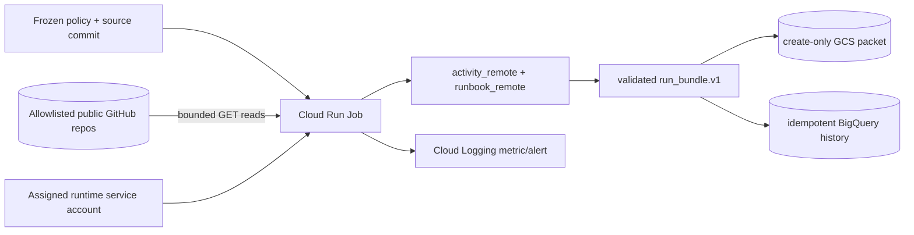

# Repo Health GCP architecture profile

**Status:** canonical; deployment-ready, not deployed or operated
**Audience:** operators, reviewers, contributors, and evaluators
**Owner:** Repo Health and GCP infrastructure maintainers
**Verified against:** `8fbf76a`

## Scope and profile boundary

The GCP profile transports and persists the existing Repo Health run-bundle
meaning. It does not move local repositories, Sheets, local plugins, Office
state, or prepared-block application into GCP.

The container runs as a non-root `office` user and invokes
`office_runtime.ops.repo_health.cloud.run_job --profile gcp`. Terraform supplies
the project, bucket, dataset, frozen policy, and `SOURCE_COMMIT`; Cloud Run
supplies assigned identity through ADC.

## Execution sequence

1. Reject missing/invalid policy, empty or more-than-three project sets, local
   path fields, unallowlisted repositories, and unsupported plugins.
2. Require snapshot `producer_commit` to equal `SOURCE_COMMIT`.
3. Reject `GOOGLE_APPLICATION_CREDENTIALS`; construct clients from ADC.
4. Read only allowlisted GitHub facts through the bounded repository-source port.
5. Normalize results, compile proposed blocks, and validate one canonical bundle.
6. Write GCS bundle then manifest with create-only preconditions.
7. MERGE BigQuery detail rows, then write the `runs` completion row.

Exact replay returns duplicate/no-op. Different bytes under one run id fail
closed. There is no GCS `latest` object and no Cloud Scheduler resource.

## Infrastructure boundary

Terraform manages seven APIs, a USD 10 monthly budget, Artifact Registry,
runtime service account, private evidence bucket, Repo Health dataset/tables/views,
bounded IAM, log-based error metric/alert, and one Cloud Run Job. The job has one
task, a 900-second timeout, one retry, 1 CPU, and 512 MiB memory. An image must be
pinned by digest and originate in the managed registry path.

## Maturity boundary

Repository evidence establishes design, implementation, local validation, and
deployment readiness. It does not establish a GCP project, applied plan, pushed
image, live job execution, evidence objects, BigQuery rows, denial probes,
teardown, or repeated operation. See the [manual deployment runbook](../operations/repo-health-gcp.md),
[security model](../reference/repo-health-gcp-security.md), and
[data model](../reference/repo-health-gcp-data-model.md).
