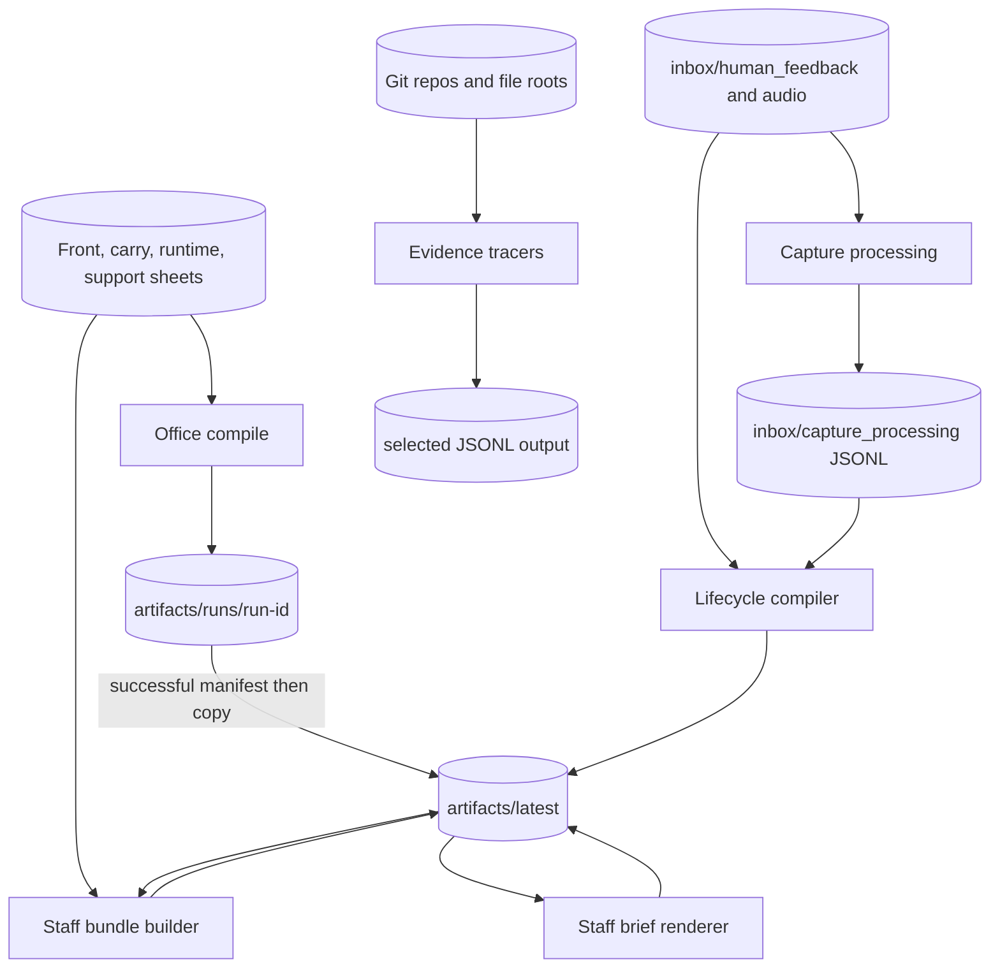
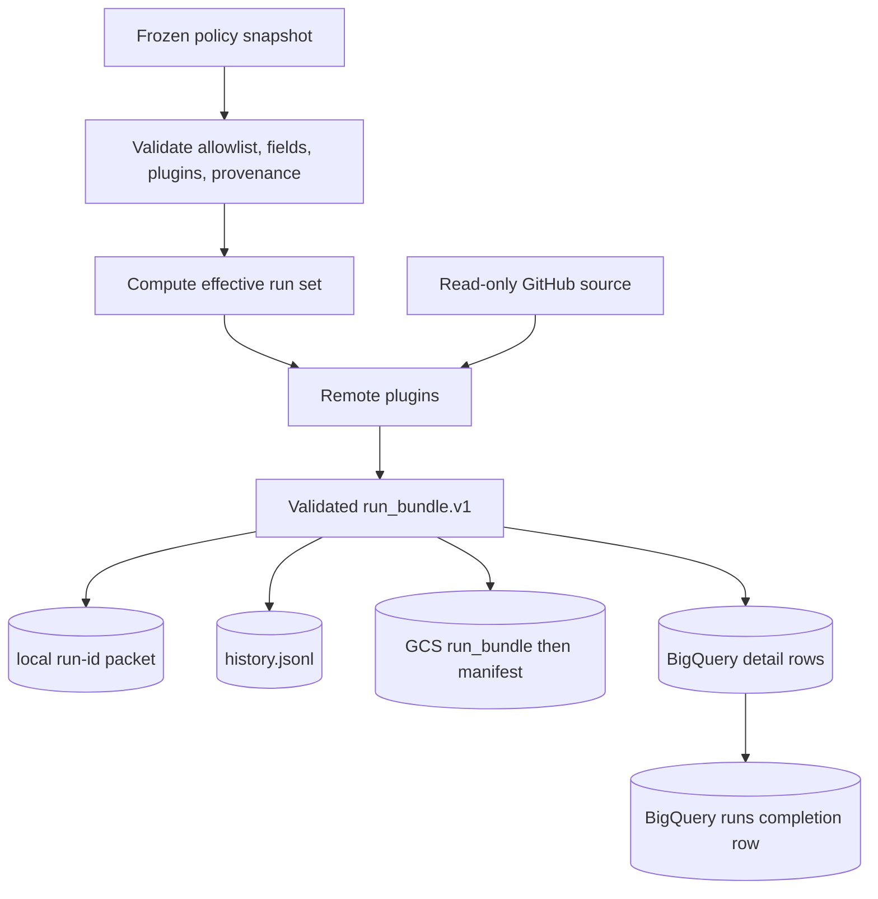

# Runtime and artifact flow

**Status:** canonical
**Audience:** contributors, operators investigating state, maintainers, and agents
**Owner:** office-auto-lab maintainers
**Verified against:** `cda8b286cc5db3c840d7f4dad143d62497f18a63`

## Scope

This page follows data from command inputs to durable outputs. It identifies
completion markers and replay behavior; it does not provide operational commands
or a complete artifact-field reference.

## Office, staff, capture, and evidence

### Office publish sequence

1. A UTC run id names `artifacts/runs/<run-id>/`.
2. Office reads front and carry sheets with read-only Sheets scope, normalizes
   them, and validates required fields.
3. A fatal validation result writes an error manifest in the run directory and
   stops; it does not promote `latest`.
4. A successful run writes routed CSVs, rendered Markdown, and `manifest.json`.
5. `promote_latest` clears `artifacts/latest/` and copies the completed run tree.
6. The CLI appends a compact daily ledger entry after a successful manifest.

The manifest is the run summary; promotion is a copy, not an atomic symlink
swap. Consumers of `latest` therefore read a mutable snapshot, while the dated
run directory retains the run-specific output.

### Staff enrichment sequence

Bundles re-read front, carry, runtime, and support sheets, then select projects
from Office's support and principal-today CSVs. Depending on scan mode, the
builder uses no scans, existing scan files, or executes bounded repository scan
scripts. It writes JSON bundles plus `ai_jobs.csv`. The brief builder consumes
those bundles and Office merged/focus state, renders Markdown locally, and writes
`brief_index.csv`. Despite the `ai_jobs` name, this code does not submit an AI
job; bundle and brief generation are deterministic local transformations.

### Capture event and observer sequence

Raw capture metadata and audio are inputs. Transcription, routing,
artifactization, and reingest-proposal functions append derived events to dated
processing JSONL unless `--dry-run` is selected. They suppress a duplicate stage
unless forced. The lifecycle compiler merges raw and derived streams by event id,
preserves malformed-input warnings, and writes lifecycle JSON/CSV/Markdown plus
candidate artifacts. It observes proposals; it does not apply them to Office
state or Google Sheets.

### Evidence sequence

Git and filesystem tracers scan caller-provided roots and date ranges, materialize
rows, and write JSONL to a required output path. The CLI also writes run logs and
a daily ledger. Evidence output is not automatically consumed by another
subsystem in the primary CLI.

## Repo Health flow

The frozen-snapshot runner validates policy before network or persistence. It
plans scheduled intents, runs only profile-approved plugins, normalizes results,
compiles frontier issues into prepared blocks, and validates the complete bundle
against `repo_health.run_bundle.v1`.

Local evidence uses a temporary directory and rename to publish
`<out>/<run-id>/{run_bundle.json,manifest.json}`. Exact replay is a no-op;
conflicting bytes for the same run id fail closed. Local JSONL history also
suppresses exact duplicates and rejects conflicts.

GCS uploads `run_bundle.json` and then `manifest.json` with create-only generation
preconditions. Existing identical bytes count as a duplicate; conflicting bytes
fail. The manifest is the packet completion marker. BigQuery checks the run id
and bundle digest, merges detail rows first using stable row ids, and writes the
`runs` row last as the history completion/idempotency marker.

## Shared observability

`RunLogger` appends structured JSONL events under `artifacts/logs/events/` and
human-readable run lines under `artifacts/logs/runs/`. CLI handlers append
compact daily ledger records under `artifacts/logs/daily/`. These logs report
execution events and artifact pointers; independent success still requires the
producer's manifest, schema validation, or expected artifact.

## Source truth

- Office sequence: `office/compile.py`, `office/io.py`
- Staff sequence: `staff/bundles.py`, `staff/briefs.py`
- Capture sequence: `capture/transcription.py`, `capture/processing.py`,
  `capture/lifecycle.py`
- Evidence sequence: `cli.py`, `evidence/git_trace.py`, `evidence/fs_trace.py`
- Repo Health model and sinks: `ops/repo_health/cloud/run_job.py`,
  `run_bundle/model.py`, `run_bundle/ports.py`, `adapters/gcp/`
- Logs: `run_logging.py`, `ledger.py`
