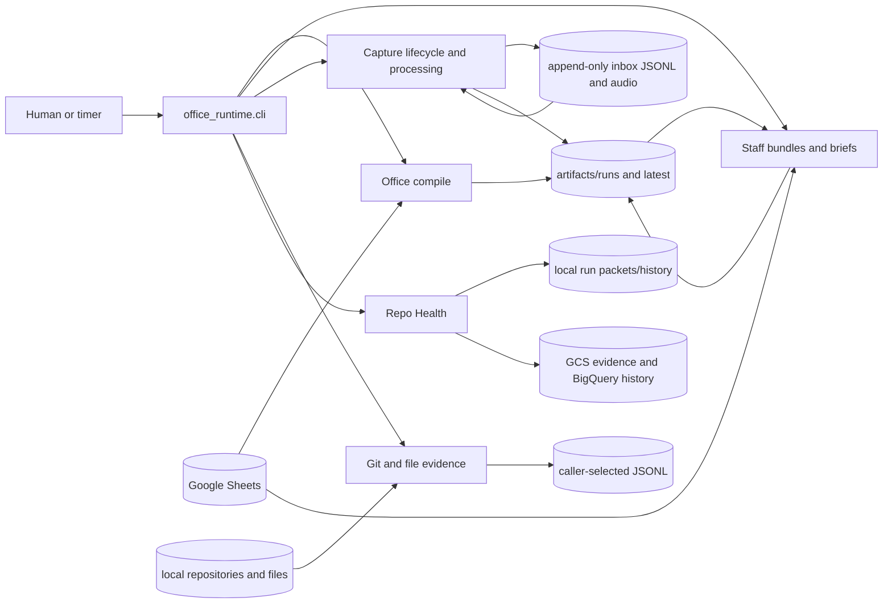

# System overview

**Status:** canonical
**Audience:** evaluators, contributors, maintainers, and agents
**Owner:** office-auto-lab maintainers
**Verified against:** `cda8b286cc5db3c840d7f4dad143d62497f18a63`

## Scope

This page explains how the major subsystems fit together and where their
boundaries are. It is not a command reference, component manual, deployment
runbook, or claim of production operation.

## System boundary

`office-auto-lab` is a command-driven Python runtime. Its primary CLI coordinates
five product surfaces—Office compile, staff, capture, evidence, and Repo Health—
while user-level systemd units provide optional scheduling. The surfaces share
logging conventions and some artifact roots, but they do not form one mandatory
pipeline.

In prose: commands enter through `src/office_runtime/cli.py`. Office reads
spreadsheet state and publishes a run directory before promoting it to
`artifacts/latest`. Staff reads both configured sheet state and selected Office
artifacts, optionally scans local repositories, and adds bundles and briefs to
the latest tree. Capture reads raw and derived append-only streams; processing
may append derived events, while lifecycle compilation writes observer artifacts.
Evidence scans caller-selected roots and writes JSONL. Repo Health has separate
local-sheet and frozen-snapshot execution paths, with local or GCP persistence.

## Subsystem responsibilities

| Subsystem | Owns | Does not own |
|---|---|---|
| Office compile | Spreadsheet normalization, validation, attention routing, compiled CSV/Markdown, run manifest, latest promotion | Capture event mutation, Repo Health semantics, staff brief rendering |
| Staff | Enriched project bundles, optional repository scans, deterministic brief rendering and indexes | Office routing rules, external AI execution, capture approval |
| Capture | Append-only transcription/processing events, lifecycle merge, candidate/review artifacts | Applying proposals to Office sheets or registries |
| Evidence | Bounded discovery of Git commits and filesystem modifications, JSONL emission | Interpreting evidence as Office or Repo Health state |
| Repo Health | Policy scheduling, plugin execution, normalized results, run-bundle contract, prepared-block compilation | Office compilation or cloud infrastructure ownership of domain meaning |
| Automation | When and how configured commands start | Command semantics or success beyond child exit status/artifacts |
| GCP infrastructure | Runtime identity, execution transport, evidence/history persistence, monitoring and cost boundaries | Repo Health policy, plugin vocabulary, normalization, or block-generation semantics |

## Execution profiles

### Local interactive and scheduled commands

Office, staff, capture, evidence, and the sheet-backed Repo Health runner execute
on the local host. Office and staff may read Google Sheets using a configured
service-account file. Capture processing may call OpenAI. Evidence and local
Repo Health plugins may read host paths. User timers invoke the same CLI through
`src/office_runtime/scripts/office_run.sh`.

### Frozen-snapshot Repo Health

`office_runtime.ops.repo_health.cloud.run_job` consumes a frozen policy snapshot
in two profiles. Both use the read-only GitHub repository source and the same
domain model:

- `local` writes immutable run packets and append-only JSONL history below a
  caller-selected local output directory;
- `gcp` uses assigned identity, writes create-only GCS objects, and merges stable
  producer-owned rows into BigQuery.

The GCP profile permits only one to three allowlisted repositories and the
`activity_remote` and `runbook_remote` plugins. It rejects local path fields and
service-account key-file configuration. These restrictions keep the cloud
profile bounded and read-only with respect to source repositories.

## Evidence-backed maturity

The code, container, Terraform, schemas, tests, and retrofit runbook make GCP
Repo Health **deployment-ready**. The repository does not contain provider-side
resource or execution evidence, so the profile is not documented as deployed or
operated. See [trust boundaries](trust-boundaries.md) for the security model and
[runtime and artifact flow](runtime-and-artifact-flow.md) for persistence order.

## Source truth

- CLI coordination: `src/office_runtime/cli.py`
- Office: `src/office_runtime/office/`
- Staff: `src/office_runtime/staff/`
- Capture: `src/office_runtime/capture/`
- Evidence: `src/office_runtime/evidence/`
- Repo Health: `src/office_runtime/ops/repo_health/`
- Automation: `systemd/user/` and `src/office_runtime/scripts/office_run.sh`
- Cloud transport/persistence: `infra/gcp/`, `Dockerfile.repo-health`, and Repo
  Health GCP adapters
- Executable evidence: `tests/`
