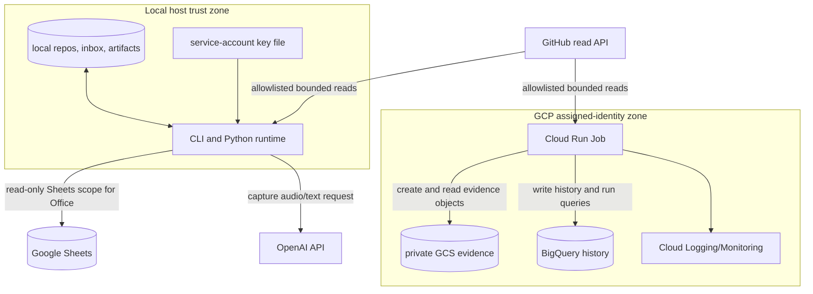

# Trust boundaries

**Status:** canonical
**Audience:** operators, contributors, security reviewers, maintainers, and agents
**Owner:** office-auto-lab maintainers
**Verified against:** `cda8b286cc5db3c840d7f4dad143d62497f18a63`

## Scope

This page identifies external authorities, mutation boundaries, credentials, and
fail-closed checks. It is architectural guidance, not a credential setup or
deployment runbook.

## Boundary map

## Local host boundary

The local process inherits the invoking user's filesystem and environment
authority. Evidence roots, capture audio roots, repository workdirs, and output
paths are caller/configuration controlled. Local Repo Health plugins can inspect
repositories and one plugin can run the repository smoke command. Staff refresh
mode executes repository scan scripts. These are local-execution capabilities,
not part of the GCP profile.

Office authenticates from `GOOGLE_APPLICATION_CREDENTIALS` (or its configured
local default) with the Sheets read-only OAuth scope. The current code does not
write Office input sheets. The sheet-backed Repo Health runner is a different
surface: without `--no-write`, it may overwrite its effective-run-set tab,
append plugin results, export local frontier files, and—with `--apply`—update
summary fields. Operators must not infer Office's read-only boundary applies to
that runner.

Capture transcription and structured processing send selected audio or derived
text to the OpenAI API. Dry-run prevents local derived-event append, but it is
not a promise that no API call occurs. Reingest output is a review proposal; the
runtime has no apply operation to mutate Office registries or Sheets.

## GCP Repo Health boundary

The cloud profile narrows authority before constructing provider clients:

1. The frozen snapshot must contain required policy sections and one to three
   projects.
2. Every project must name an allowlisted `repository_full_name`; local path
   fields are rejected.
3. Only `activity_remote` and `runbook_remote` may be enabled.
4. The snapshot's producer commit must equal the image `SOURCE_COMMIT`.
5. `GOOGLE_APPLICATION_CREDENTIALS` is rejected; the job uses Application
   Default Credentials from its assigned runtime service account.

The GitHub adapter permits bounded GET reads for allowlisted repositories. The
profile contains no source-repository write adapter, no Scheduler resource, and
no path for applying prepared blocks to Office state.

Terraform grants the runtime identity only the roles needed to read/create
evidence objects, edit the Repo Health dataset, run BigQuery jobs, write logs,
and pull its image. The evidence bucket enforces uniform access and public-access
prevention. Object creation uses a zero-generation precondition, and conflicts
fail closed. BigQuery row identities and bundle hashes are producer-owned;
conflicting replay fails rather than overwriting domain history.

## Secrets and provenance

| Material | Boundary / rule |
|---|---|
| Local Google service-account JSON | Local-only credential for sheet-facing paths; never valid evidence of GCP assigned identity. |
| OpenAI API credential | Process environment consumed by the OpenAI client; must not enter capture events, artifacts, or logs. |
| GitHub token | Optional input for remote reads; repository allowlist remains mandatory. |
| Frozen policy JSON | Configuration plus provenance input; its canonical bytes determine policy identity/hash. |
| Container image | Must come from the Terraform-managed Artifact Registry path; snapshot producer commit must match `SOURCE_COMMIT`. |
| Repo Health run id and row ids | Producer-owned identities; replay with different bytes/hash is rejected. |

## Denied operations and stop conditions

- Stop if cloud policy includes local paths, an unallowlisted repository, an
  unsupported plugin, or more than three projects.
- Stop if GCP mode sees a service-account key-file environment variable, missing
  assigned project/bucket configuration, or provenance mismatch.
- Stop on immutable-object or stable-row identity conflict; do not “repair” it by
  overwriting evidence.
- Do not treat a capture proposal as approved or applied.
- Do not install the committed systemd units without reviewing their host-specific
  working directory and command paths.
- Do not describe GCP resources as deployed or the workflow as operated without
  provider-side evidence.

## Source truth

- Local Sheets boundary: `office/io.py`, `office/config.py`,
  `ops/repo_health/runner.py`, `ops/repo_health/sheets.py`
- Capture boundary: `capture/transcription.py`, `capture/processing.py`, schemas
  and tests
- Cloud validation/source: `ops/repo_health/cloud/run_job.py`,
  `ops/repo_health/remote/source.py`, remote plugins
- Persistence conflict rules: `run_bundle/ports.py`, `adapters/gcp/storage.py`,
  `adapters/gcp/bigquery.py`
- Provider authority: `infra/gcp/main.tf`
