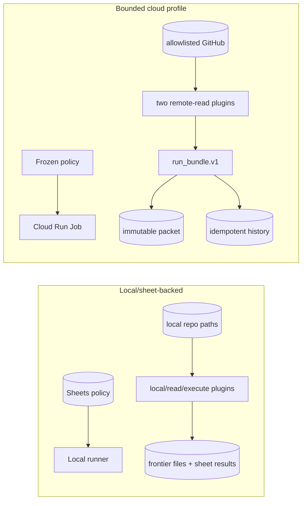

# Case study: bounded GCP Repo Health retrofit

**Status:** canonical case study; deployment-ready, not deployed or operated
**Audience:** evaluators, architects, maintainers, and reviewers
**Owner:** office-auto-lab maintainers
**Verified against:** `8fbf76a`

## Problem and constraints

Repo Health began as a sheet-backed/local runner whose plugins could inspect
paths and execute local smoke commands. The cloud goal was not to lift that host
authority into GCP. It was to execute a small, read-only remote profile while
preserving the existing policy, classification, compiler, and evidence meaning.

Constraints were one-to-three explicit repositories, no source writes, no key
files, immutable evidence, idempotent analytical history, low/manual cost, and
honest separation between implementation and provider operation.

## Before and after

The after design adds a repository-source port and cloud adapters around domain
logic. Infrastructure transports execution and persistence; it does not own
policy, result normalization, run status, or prepared-block semantics.

## Decisions and rejected alternatives

| Decision | Reason | Rejected alternative |
|---|---|---|
| Frozen policy injected with source provenance | Reviewable, bounded first-run input | Live Sheets access from Cloud Run, which expands credentials/mutation surface |
| Explicit repository and plugin allowlists | Fail-closed scope | Upload local paths or dynamically enable every plugin |
| Assigned runtime identity | Avoid durable key material | Service-account JSON in image/env |
| Canonical run bundle before adapters | One domain truth across local/GCP | Provider tables define or drift domain meaning |
| Create-only GCS packet, no latest | Immutable independently verifiable evidence | Mutable object overwritten per run |
| Stable-row BigQuery MERGE, runs last | Replay and partial-write reconciliation | Blind append or runs-first success marker |
| Manual first execution, no Scheduler | Bound cost and require evidence gate | Schedule before first-run reconciliation |
| Digest-pinned managed image | Join runtime to accepted source | Mutable tag |
| Protected evidence and explicit destroy switch | Prevent accidental loss | Default force-destroy |

## Engineering outcomes

The implementation provides strict cloud-policy validation, two source-parity
remote plugins, versioned run bundles, linked exceptions/prepared blocks,
conflict-rejecting local/GCP sinks, partitioned modeled history, least-authority
IAM, non-root container, provenance checks, cost alerting, and a manual evidence
protocol with denial probes and teardown disposition.

Tests cover snapshot rejection, bounded GET behavior, local/remote plugin parity,
bundle validation, exact replay/conflict, GCS create-only writes, BigQuery
completion ordering/idempotency, key-file rejection, container constraints, and
bounded Terraform/no Scheduler. Local validation does not prove provider state.

## Claim and evidence matrix

| Claim | Evidence | Status |
|---|---|---|
| Architecture/contract designed | Retrofit contracts, schemas, architecture pages | Designed |
| Runtime/adapters/IaC exist | Python, Dockerfile, Terraform, SQL | Implemented |
| Policy, bundle, adapters, remote boundaries validated | Local tests and `--validate-only` | Locally validated, with recorded environment test limitation |
| Provider package is coherent | IaC, container, runbook, preflight, evidence protocol | Deployment-ready |
| Resources and one run exist | Would require applied plan, execution, GCS/BQ/log/denial packet | **Not evidenced; not deployed** |
| Repeated runs/recovery/observability exist | Would require multiple reconciled executions and failure recovery | **Not evidenced; not operated** |

## Remaining gate

An authorized human must execute the canonical
[GCP runbook](../operations/repo-health-gcp.md), reconcile all identities and
denials, decide teardown, and preserve provider evidence. Until then, phrases
such as “running in GCP,” “production,” or “operated” are unsupported.

The original retrofit plans, prompts, and closure notes remain supporting history
under `docs/retrofit/gcp_project_health/` and `context/closures/`; they are not
the canonical deployment procedure.
